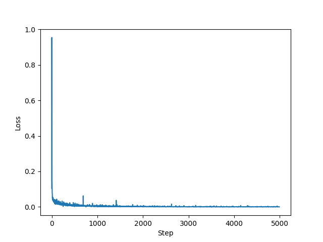
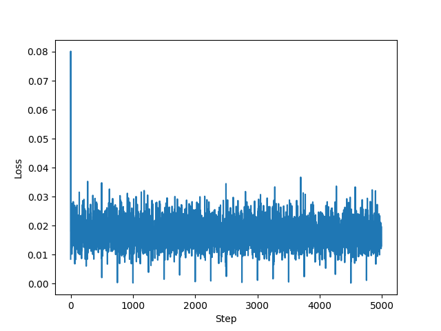
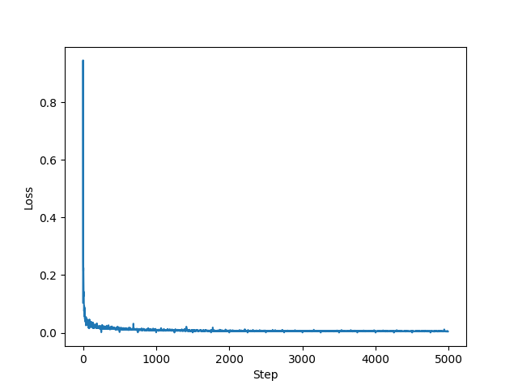
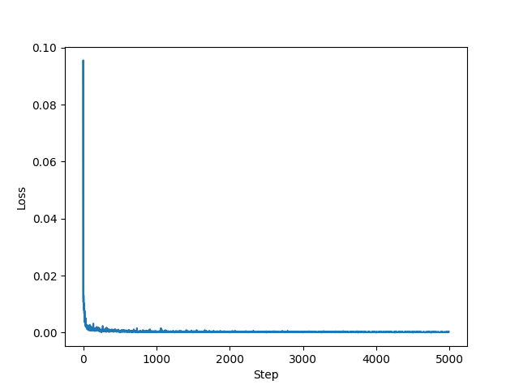
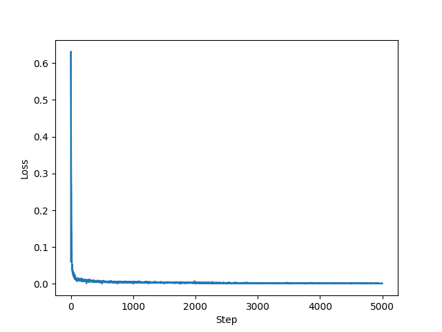
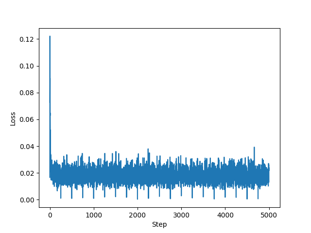
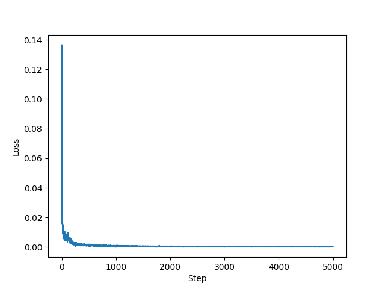
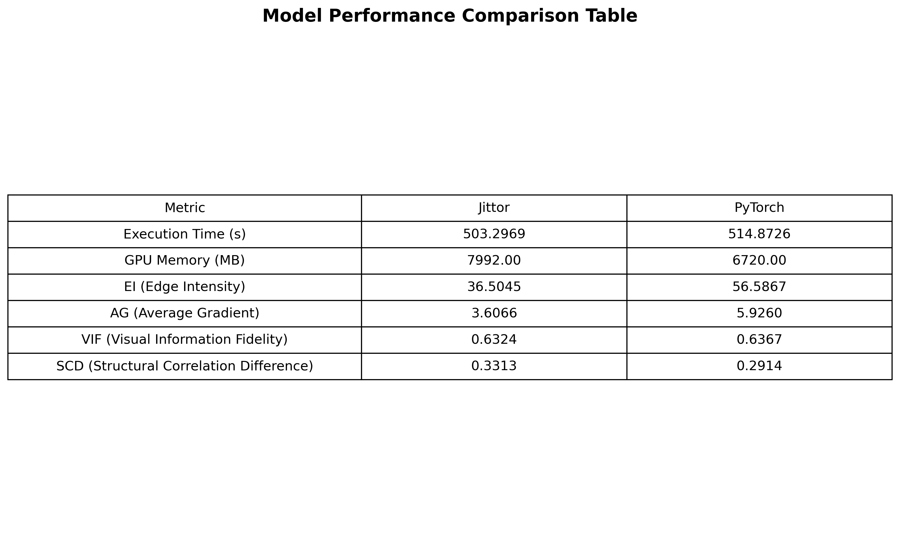
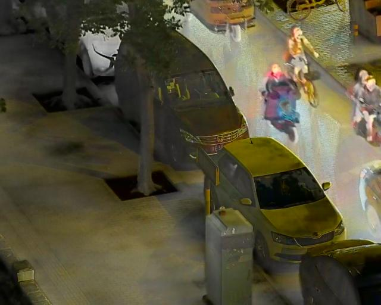
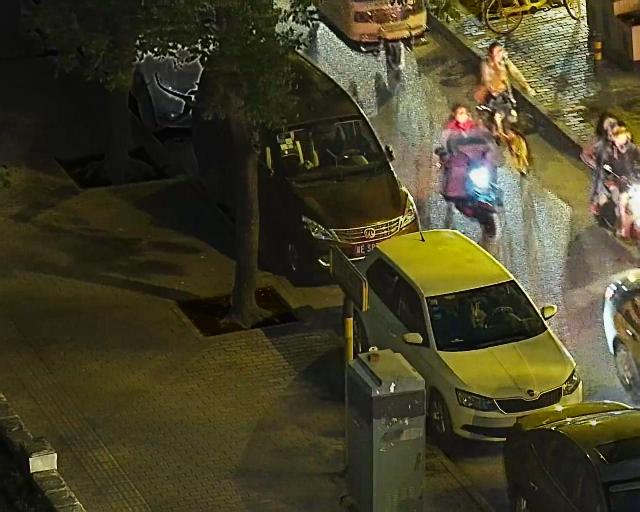

## 使用jittor框架完成GIFNet的复现
## 持续更新中！

### 1. 环境配置
见requirements.txt文件（里面有关torch的是为了用统一的conda环境进行pytroch版本的训练与测试）

### 2. 数据准备脚本
该实验数据处理比较简单，无需单独的数据准备脚本，只需要按照如下压缩包解压，放在train_data目录下即可。在训练的过程中会直接使用Dataloader进行提取。其中有个参数，在args文件中的 *train_num* ,该变量是指在训练过程中使用多少数据集进行训练。
#### 数据集
      数据集 - [百度网盘 (code: h6hu)](https://pan.baidu.com/s/1AR5rFQXmK9FSkUUFg77nHg?pwd=h6hu)

### 3. 训练脚本
```cpp
python train.py --trainDataRoot "./train_data"
```
注：在train.py文件中将 *trainDataRoot* 参数已经设为了默认的 *./train_data*。
因此，训练脚本还可以直接使用
    ```cpp
    python train.py
    ```

### 4. 测试脚本

 参数如下:

```cpp
"--test_ir_root": 红外图像的根路径.
"--test_vis_root": 可见光图像的根路径.
"--VIS_IS_RGB": 可见光图像以 RGB 格式存储.
"--IR_IS_RGB": 红外图像以 RGB 格式存储.
"--save_path": 融合图像的存储路径.
```

 红外和可见共图像融合(IVIF):

```cpp
python test.py  --test_ir_root "images/IVIF/ir" --test_vis_root "images/IVIF/vis" --save_path "./outputs/outputsIVIF/jittor" --VIS_IS_RGB 
```

 多聚焦图像融合(MFIF):

```cpp
python test.py  --test_ir_root "images/MFIF/nf" --test_vis_root "images/MFIF/ff" --save_path "./outputs/outputsMFIF/jittor" --IR_IS_RGB --VIS_IS_RGB
```

 多曝光图像融合(MEIF):

```cpp
python test.py  --test_ir_root "images/MEIF/oe" --test_vis_root "images/MEIF/ue" --save_path "./outputs/outputsMEIF/jittor" --IR_IS_RGB --VIS_IS_RGB 
```

 医学图像融合:

```cpp
python test.py  --test_ir_root "images/Medical/pet" --test_vis_root "images/Medical/mri" --save_path "./outputs/outputsMedical/jittor" --IR_IS_RGB
```

 近红外与可见光图像融合(NIR-VIS)

```cpp
python test.py  --test_ir_root "images/NIR-VIS/nir" --test_vis_root "images/NIR-VIS/vis" --save_path "./outputs/outputsNIR-VIS/jittor" --VIS_IS_RGB
```

 遥感图像融合(Remote)

第一步 : 将多光谱图像的不同波段与全色图像分别进行融合

(Python)
```cpp
python test.py  --test_ir_root "images/Remote/MS_band1" --test_vis_root "images/Remote/PAN" --save_path "./outputs/Remote/outputsRemoteBand1/jittor"
python test.py  --test_ir_root "images/Remote/MS_band2" --test_vis_root "images/Remote/PAN" --save_path "./outputs/Remote/outputsRemoteBand2/jittor"
python test.py  --test_ir_root "images/Remote/MS_band3" --test_vis_root "images/Remote/PAN" --save_path "./outputs/Remote/outputsRemoteBand3/jittor"
python test.py  --test_ir_root "images/Remote/MS_band4" --test_vis_root "images/Remote/PAN" --save_path "./outputs/Remote/outputsRemoteBand4/jittor"
```
### 5. 实验log
**_为了公平，于是统一标准。训练过程中参数相同，batch 大小为 4，训练样本数据 10000，训练轮数为 20, 学习率固定为 1e-4, 优化器选择的 Adam.测试中使用 640×540 分辨率的图片进行测试。_**

在此处分别展示 jittor 和 pytorch 的训练过程中的loss变化，同时可以查询我的nohup文件中查询我的训练过程。
四种loss分别是IVIF的混合分支损失，IVIF的重建分支损失，MFIF的混合分支损失,MFIF的重建分支损失.

**_jittor框架_**






**_pytorch框架_**






### 6. 性能log
**_可见outputs,其中包含了多种情况下的测试图片_**.
由于时间原因，在本次考核中我只做了有关IVIF的较大数据集LLVIP的测试，以下为各种测评指标（对应论文中的四种指标）

评估脚本
```cpp
python run_evaluation.py
```


样例对比




### 7. 实验总结
可以见到在训练过程中jittor框架的训练时长比pytorch框架的要长，显存也要大（为了防止本模型的问题，尝试了训练RESNET18，在文件夹compare中，也是这种情况），推理速度相似，性能略差。

### 8. 反思
得到的模型结果并不是很好，融合记过偏向于红外图像，因此还在努力改进，经仔细查询和调试发现模型没有差别，目前正在损失函数和优化器，尝试优化 jittor 框架模型。

## 备注
### 安装 jittor 遇到的问题以及解决办法
1. 
 - 报错：显示  version GLIBCXX_3.4.30 not found  
 - 原因： 表示 Jittor 编译生成的 .so 文件依赖了 libstdc++.so.6 中的 GLIBCXX_3.4.30 版本符号，但你的当前环境中没有该版本的 libstdc++
 - 解决方案 ：在 Conda 环境中升级 gcc/libstdc++，不会影响系统环境。使用如下命令 `conda install -c conda-forge gcc`
2. 
 - 报错：raise RuntimeError(f"MD5 mismatch between the server and the downloaded file {file_path}")
 - 原因：Jittor 在下载 CUTLASS 库时，文件校验失败（MD5 不匹配）
 - 解决方案： 从网上把.zip文件复制下来直接放到相应位置了 可以参考 https://discuss.jittor.org/t/topic/936
  - cutlass文件 - [百度网盘 (code: h6hu)](https://pan.baidu.com/s/1AR5rFQXmK9FSkUUFg77nHg?pwd=h6hu)
 3.
 - 报错：CUDA found but cudnn is not loaded
 - 原因：找到了cuda但是没有正确加载
 - 解决方案：使用官方推荐的命令`python -m jittor_utils.install_cuda`,之后改变环境变量`export LD_LIBRARY_PATH=/root/.cache/jittor/jtcuda/cuda12.2_cudnn8_linux/lib64:$LD_LIBRARY_PATH`（下载完成后需要等待一段时间，请耐心，强制关闭可能会出问题）
